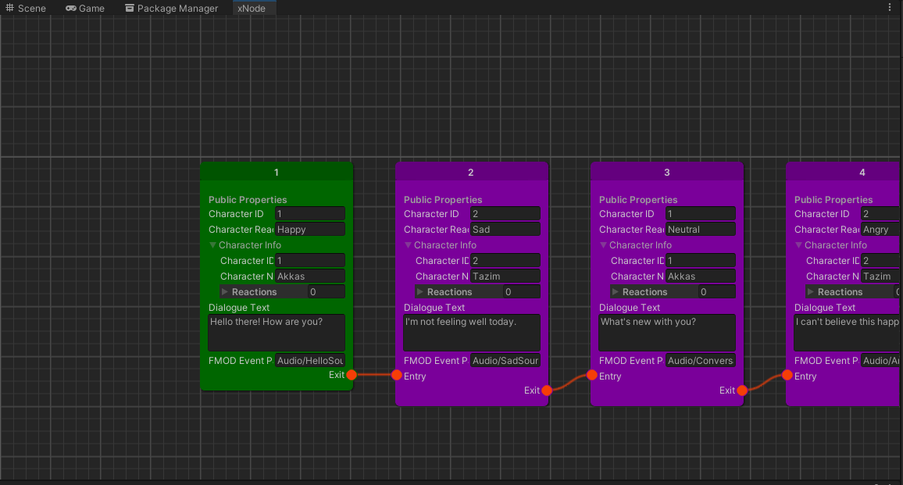

<h1 align="center">Dialogue System</h1><p align="center">
<a href="https://openupm.com/packages/com.studio23.ss2.dialoguesystem/"></a>
</p>

Dialogue System is an open source package for dialogue in your game. It supports:
1. Dialogue Choices
2. Unity localization support
3. Custom editor for easily writing lines. No need to wrangle with the localization UI.
4. Node based UI
5. Timeline support



## Table of Contents

1. [Installation](#installation)
2. [Usage](#usage)

## Installation

### Install via Git URL

You can also use the "Install from Git URL" option from Unity Package Manager to install the package.
```
https://github.com/Studio-23-xyz/com.studio23.ss2.dialoguesystem.git#upm
```

## Usage

### Using Dialogue System
1. Create a dialogue graph.
2. `DialogueManager.Instance.StartDialogue(graph)`
Samples contain an example of a helper monobehavior that keeps a reference to a graph and allows starting dialogues from there.

### Dialogue Graph Rules:
1. Must have at least one startnode. If you have multiple startnodes, please read the corresponding section. 
2. If anything can be connected, you can connect them.

### Adding UI
The sample scene contains example UI. You can create your own UI by using the following events in `DialogueSystem.cs`:
```
        public event Action<bool> OnSkipToggled; 
        
        public event Action<DialogueGraph> OnDialogueStarted; 
        public event Action<DialogueGraph> OnDialogueEnded; 
        
        public event Action<DialogueChoicesNode> OnDialogueChoiceStarted; 
        public event Action<DialogueChoicesNode> OnDialogueChoiceEnded; 
```
### Multiple Startnodes in graph:
By default it takes the first startnode it finds. If you have multiple start nodes, this is unreliable. In this case, pass the specific startnode you want to start with.
```
DialogueSystem.Instance.StartDialogue(DialogueNodeBase node);
```
Or:
```
DialogueSystem.Instance.PlayDialogue(DialogueNodeBase node);
```
The node can be any node, not just a startnode. The samples contain a helper class with a custom editor that will help you pick startnodes if you have multiple.

### Timeline Support
The samples contain examples of timeline support with custom timeline clips utilizing the dialogue system. You'll need to have:
1. A DialogueManager active in the scene
2. Assign a DialogueUI to the track.

The samples contain an example DialogueUI base class. The base class isn't required for the rest of the package but required for timeline support. Any UI that ingherits it can be assigned to the track.

Note: Editor preview for dialogue clips only shows the first line. Since the dialogue can branch or loop, there is no way to preview the entire dialogue in the timeline preview. In playmode, the whole dialogue chain is played from the given node. 

### Skipping dialogue:
`DialogueSystem.Instance.ToggleSkip()`

# Contribution
https://github.com/Studio-23-xyz/com.studio23.ss2.dialoguesystem/blob/main/CONTRIBUTING.md