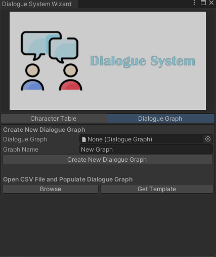

<h1 align="center">Dialogue System</h1><p align="center">
<a href="https://openupm.com/packages/com.studio23.ss2.dialoguesystem/"></a>
</p>

Dialogue System is an open source package for dialogue in your game. It supports:
1. Dialogue Choices
2. Unity localization support
3. Custoom editor
4. Node based UI




## Table of Contents

1. [Installation](#installation)
2. [Usage](#usage)


## Installation

### Install via Git URL

You can also use the "Install from Git URL" option from Unity Package Manager to install the package.
```
https://github.com/Studio-23-xyz/com.studio23.ss2.dialoguesystem.git#upm
```

## Usage

### Using Dialogue System

1. Access the Wizard from top toolbar Studio-23 > Dialogue System > Dialogue System Wizard

2. Follow the process in the Wizard to create your Dialogue Graphs.

3. Add the Dialogue Manager Singleton in your Scene

4. Implement your own Dialogue UI as per need. (Check Samples for demonstration)

# Contribution
https://github.com/Studio-23-xyz/com.studio23.ss2.dialoguesystem/blob/main/CONTRIBUTING.md


