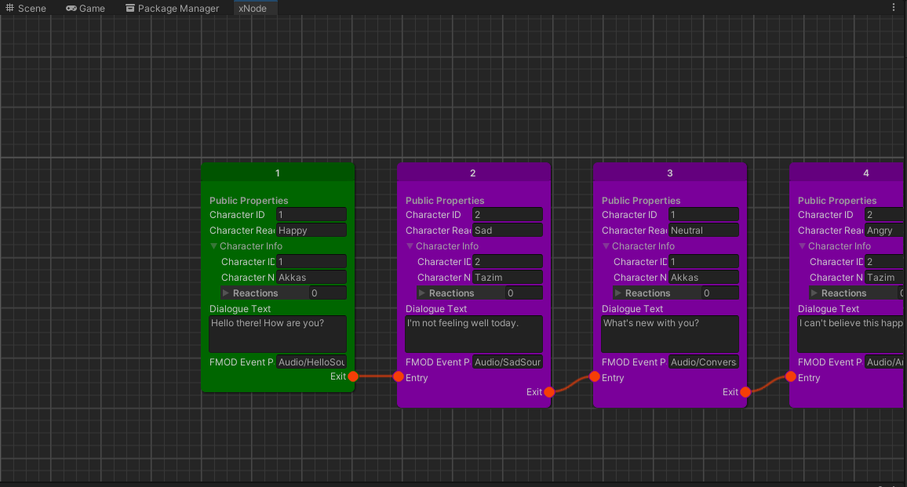

<h1 align="center">Dialogue System</h1><p align="center">
<a href="https://openupm.com/packages/com.studio23.ss2.dialoguesystem/"></a>
</p>

Dialogue System is a package created for tooling Silent Scream 2 Game. However it can be used for most games. It provides a set of tools to streamline your in game dialogue system needs.




## Table of Contents

1. [Installation](#installation)
2. [Usage](#usage)


## Installation

### Install via Git URL

You can also use the "Install from Git URL" option from Unity Package Manager to install the package.
```
https://github.com/Studio-23-xyz/com.studio23.ss2.dialoguesystem.git#upm
```

## Usage

### Using {Your_Package}

Description about the package usage goes here. 

1. Access the Wizard from top toolbar Studio-23 > Dialogue System > Dialogue System Wizard

2. Follow the process in the Wizard to create your Dialogue Graphs.

3. Add the Dialogue Manager Singleton in your Scene

4. Implement your own Dialogue UI as per need. (Check Samples for demonstration)

### Modifying the Package //Optional sub-sections

You can also include code snippets by using the following syntax. 

```Csharp
DialogueManager.Instance.ChangeDialogueGraph(newGraph); // Register a new Graphs

// Subscribe to events before you play Dialogue.

DialogueManager.Instance.PlayDialogue();// Start Playing dialogue
```